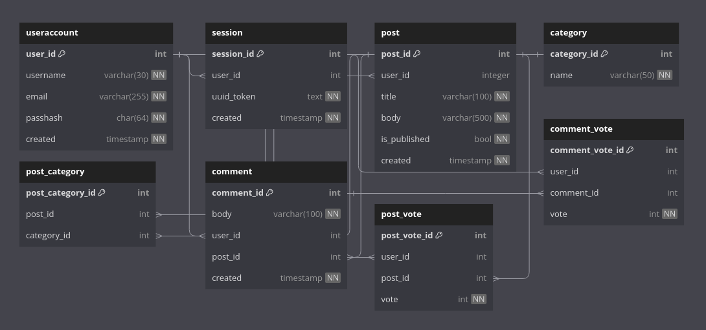

# Project: FORUM

<details>
<summary>Intro</summary>
<br>

## To build and run the project follow the steps below:
- Navigate to `/code/forum/`
- Build the Dockerfile:
	- `docker build -t forum .`
	- `docker run -p 4000:4000 forum`
	- In browser `localhost:4000`
- Run the project manually:
	- `sqlite3 mydb < forum.sql`
	- `go run cmd/web/*`
	- In browser `localhost:4000`
- Enjoy!

In the Go branch, the FORUM node consists of several projects, refer to the below tree diagram.

This repository codebase is for **The Main Forum Project**.

```
.
├── main-project
│   └── forum
└── optional-projects
    ├── advanced-features
    ├── authentication
    ├── image-upload
    ├── moderation
    └── security
```
</details>

<details>
<summary>Technical Requirements</summary>

## Forum Technical Requirements

### Objectives

This project consists of creating a *web forum* that allows:

- communication between users;
- associating categories to posts;
- liking and disliking posts and comments;
- filtering posts.

#### SQLite

In order to store the data your forum (like users, posts, comments, etc.) you will use the database library SQLite.

SQLite is a popular choice as an embedded database software for local/client storage in application software such as web browsers. It enables you to create a database as well as controlling it by using queries.

To structure your database and to achieve better performance, we highly advise you to take a look at the **entity relationship diagram** and build one based on your own database.

- You must use at least one *SELECT*, one *CREATE* and one *INSERT* queries.

To know more about SQLite, you can check the [SQLite page](https://www.sqlite.org/index.html).

#### Authentication

In this segment the client must be able to `register` as a new user on the forum, by inputting their credentials. You also have to create a `login session` to access the forum and be able to add posts and comments.

You should use *cookies to allow each user to have only one opened session*. Each of these sessions must contain an *expiration date*. It is up to you to decide how long the cookie stays "alive". The use of *UUID* is a Bonus.

##### Instruction for user registration:

- Must ask for *email*
	- When the email is already taken, return an error response.
- Must ask for *username*
- Must ask for *password*
	- The password must be encrypted when stored (Bonus). 

The forum must be able to check if the email provided is present in the database and that all credentials are correct. It has to check whether the password provided is the same as the obe stored in the database. If the passwords do not match, it has to return an error response.

#### Communication

In order for users to communicate between each other, they will have to be able to create posts and comments.

- Only registered users will be able to create posts and comments;
- When registered users are creating a post, they can associate one or more categories to it;
	- The implementation and choice of categories is up to you.
- The posts and comments should be visible to all users (registered or not);
- Non-registered users will only be able to see posts and comments.

#### Likes and dislikes

Only registered users will be able to like or dislike posts and comments.

The number of likes and dislikes should be visible by all users (registered or not).

#### Filters

You need to implement a filter mechanism, that will allow users to filter the displayed posts by:

- categories;
- created posts;
- liked posts.

You can look at filtering by categories as subforums. A subforum is a section of an online forum dedicated to a specific topic.

Note that the last two are only available for registered users and must refer to the logged in user.

#### Docker

For the forum project you must use *Docker*.

### Instructions

- You must use **SQLite**;
- You must handle website errors, HTTP status;
- You must handle all sort of technical errors;
- The code must respect the **good practices**;
- It is recommended to have **test files** for *unit testing*.

### Allowed packages

- All standard Go packages are allowed
- *sqlite3*
- *bcrypt*
- *UUID*

> You must not use any fronted libraries or frameworks like React, Angular, Vue etc.

This project will help you learn about:

- The basics of web:
	- HTML
	- HTTP
	- Sessions and cookies

- Using and setting up Docker
	- Containerizing an application
	- Compatibility/Dependency
	- Creating images

- SQL language
	- Manipulation of databases

- The basics of encryption

</details>

<details>
<summary>Architecture & Design</summary>

## Forum Architecture & Design

### ERD (Entity Relationship Diagram)



### Routing Requests

|**HTTP Method**|**URL Pattern**|**Handler**|**Action**|
|---|---|---|---|
|ANY|/|home|Display the home page|
|---|---|---|---|
|GET|/posts/:post_id|showPost|Display a specific post|
|GET|/posts/create|createPostForm|Display a new post form|
|POST|/posts/create|createPost|Create a new post|
|GET|/posts/:post_id/vote/:vote|votePost|Vote the post with post_id|
|GET|/posts/:post_id/comments/:comments_id/vote/:vote|voteComment|Vote the comment with comment_id|
|POST|/comments/create/:post_id|createComment|Create a new comment for post with post_id|
|---|---|---|---|
|GET|/category/:category_id|showCategoryPosts|Display all posts for the category|
|GET|/user/posts|showUserCreatedPosts|Display all posts created by the user|
|GET|/user/upvotes|showUserUpvotedPosts|Display all posts *upvoted* by the user|
|---|---|---|---|
|GET|/user/signup|signupUserForm|Display the user signup form|
|POST|/user/signup|signup|Create a new user|
|GET|/user/login|loginUserForm|Display the user login form|
|POST|/user/login|login|Authenticate and login the user|
|POST|/user/logout|logout|Logout the user|
|---|---|---|---|
|ANY|/static/|http.FileServer|Serve a specific static file|
</details>

<details>
<summary>Team</summary>

## Team

- qazmaster
- bauyezov
- aibek.ryskaliyev

</details>
